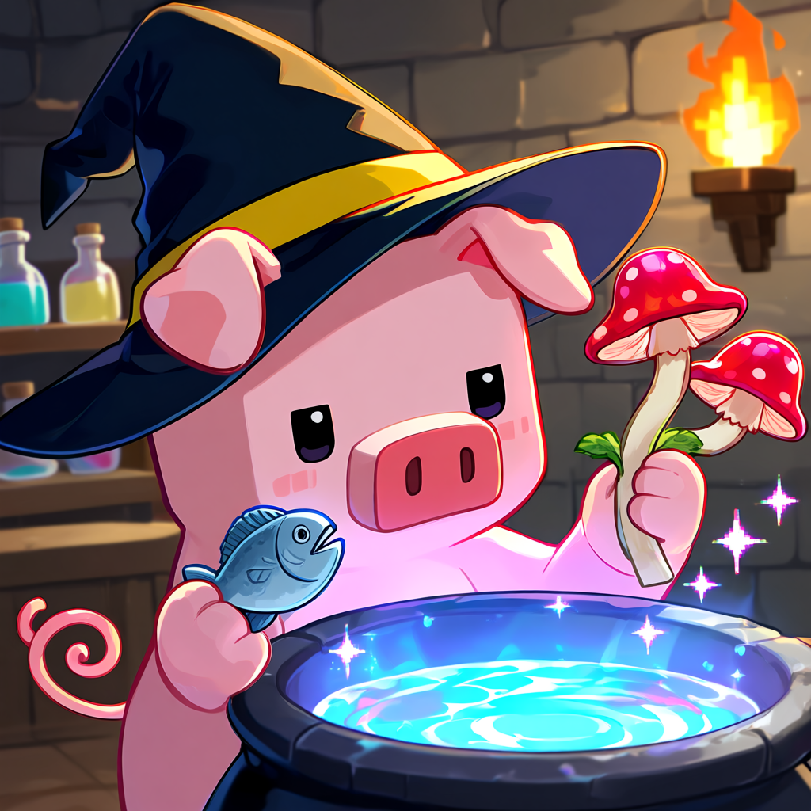

# Melnus's Forbidden Arts

A Minecraft Bedrock Add-on that delves into the dark side of alchemy. What started as basic resource transmutation has evolved into the creation of ancient life, artificial dimensions, and forbidden relics.

This add-on allows players to manipulate life itself and synthesize items that were never meant to be crafted, pushing the boundaries of survival progression.

---

## Overview

Melnus's Forbidden Arts is the dark continuation of the CraftBook alchemy system. 

Instead of relying on natural generation, you will harness the bizarre power of the Nether, the Abyss, and strange organic materials to bend reality to your will. Need an End Portal? Build it. Need ancient creatures? Clone them. 

The core idea is simple:

> "When you gaze into the nether wart, the nether wart also gazes into you."

---

## Core Features

### 🍄 1. The Dark Catalyst
The **Nether Wart**, **Ghast Tear**, and **Poisonous Potato** are no longer just brewing ingredients—they are the twisted foundations of forbidden alchemy, capable of forcing life and matter to mutate.

### 🧬 2. Artificial Life Generation
Play god by synthesizing Spawn Eggs for rare, aquatic, and ancient mobs from scratch:
- **Ancient Life**: Sniffer, Armadillo, Allay
- **Aquatic Life**: Axolotl, Pufferfish, Tropical Fish, Turtles
- **Beasts & Pets**: Wolves, Cats, Foxes, Horses, Camels, Llamas

### 👁️‍🗨️ 3. Forbidden Relics & Dimensions
Craft items that dictate the rules of the world.
- Create an **End Portal Frame** directly from End Stone and Ender Pearls.
- Synthesize **Wither Skeleton Skulls** to summon the boss at your convenience.
- Concoct the **Ominous Bottle** to trigger raids on demand.
- Craft the **Heart of the Sea** from sheer magical resonance.

### 🐚 4. Custom Gear Transmutation: Nautilus Armor Tier
Harness the power of the ocean by combining Nautilus Shells with different metals to create a unique line of custom armor:
- Copper → Iron → Gold → Diamond → Netherite Nautilus Armor

### ❄️ 5. Environmental Manipulation
Why search for biomes when you can craft them?
Synthesize Ice, Packed Ice, Sweet Berries, Torchflower Seeds, and even Soul Sand from basic alchemical combinations.

---

## Example Recipes

- Nether Wart + Rotten Flesh + Emerald → Ominous Bottle
- End Stone + Ender Pearl + Diamond + Experience Bottle → End Portal Frame
- Bone Meal + Coal + Netherrack + Ghast Tear → Wither Skeleton Skull

- Ghast Tear + Moss Block + Cow Spawn Egg → Sniffer Spawn Egg
- Ghast Tear + Jukebox + Feather → Allay Spawn Egg
- Nether Wart + Sand + Bone Meal → Armadillo Spawn Egg

- Pufferfish + Salmon + Slime Ball → Nautilus Shell
- Nautilus Shell + Diamond + Pufferfish → Diamond Nautilus Armor
- Diamond Nautilus Armor + Netherite Ingot + Experience Bottle → Netherite Nautilus Armor

- [Other recipes](./recipes.md)

---

## Design Philosophy
  
This add-on is designed around three core ideas:

**The unobtainable is in your hands**  
**Life is but a recipe**  
**Dark alchemy demands strange materials**  
  
It removes the need for world exploration to find structures or rare mobs, replacing it with a mad-scientist progression system.  

---

## Intended Gameplay Style

- "Mad Scientist" / Dark Wizard roleplay
- End-game Skyblock expansion
- Complete control over world resources and dimensions
- Progression through experimentation rather than exploration

---

## Compatibility

Minecraft Bedrock Edition (1.21.0+)
Works perfectly alongside the original *Melnus's CraftBook*, or as a standalone dark magic overhaul.

---

## Notes

This add-on is highly experimental and completely breaks vanilla progression and rarity. It is intended for players who want to build, farm, and conquer the world's most difficult items from the comfort of their own dark laboratory.

---

## License

Free to use, modify, and distribute with credit to Melnus.
